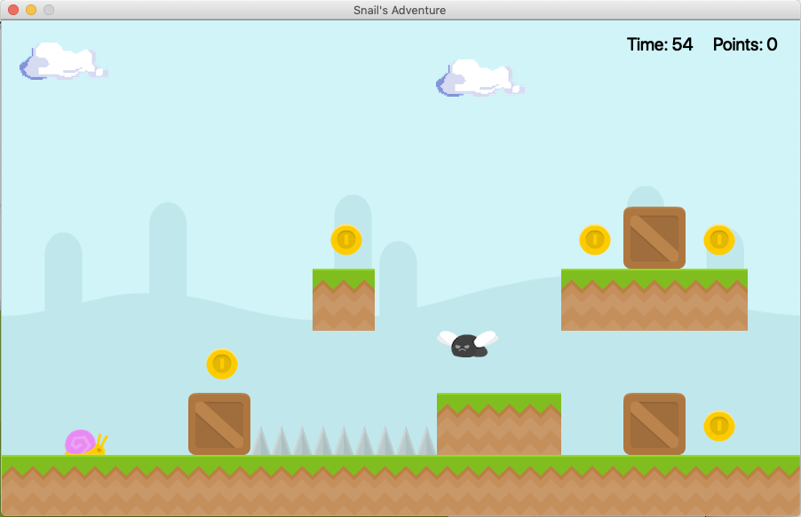

# PyQt5 Platform Game

## Installing

Please type these commands into your command window.

* Installing Python3:

```brew install python3```

* Installing PyQt5:

```brew install pyqt5```

* If the above is not working, try these commands:

```unset PYTHONPATH```
```brew install sip --with-python3```
```brew install pyqt5 --with-python3```

## Running The Program

Type this into your command window.

```python3 main.py```

## About

I created a basic platform game with Python using PyQt5 library.




**Graphics**:

- https://opengameart.org/content/platformer-art-deluxe
- https://www.deviantart.com/clipclapcat/art/Cloud-A-sprite-723248046